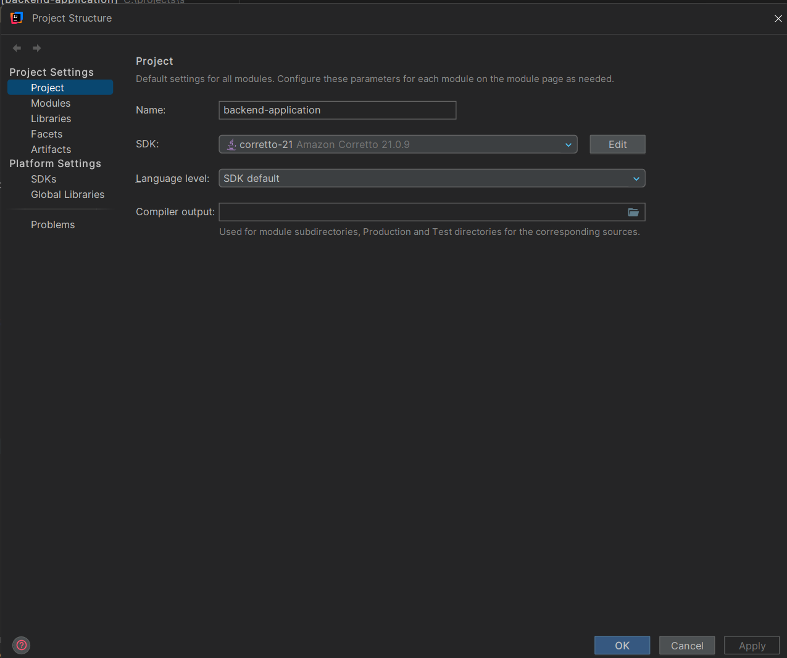
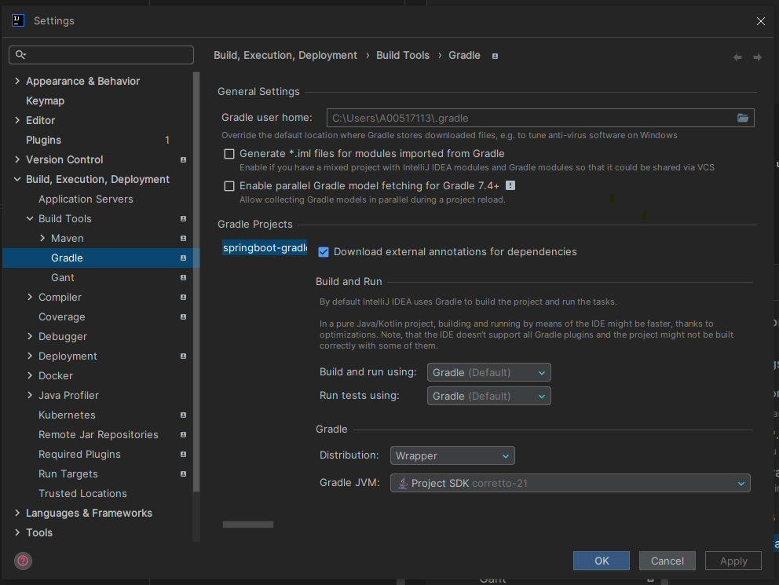
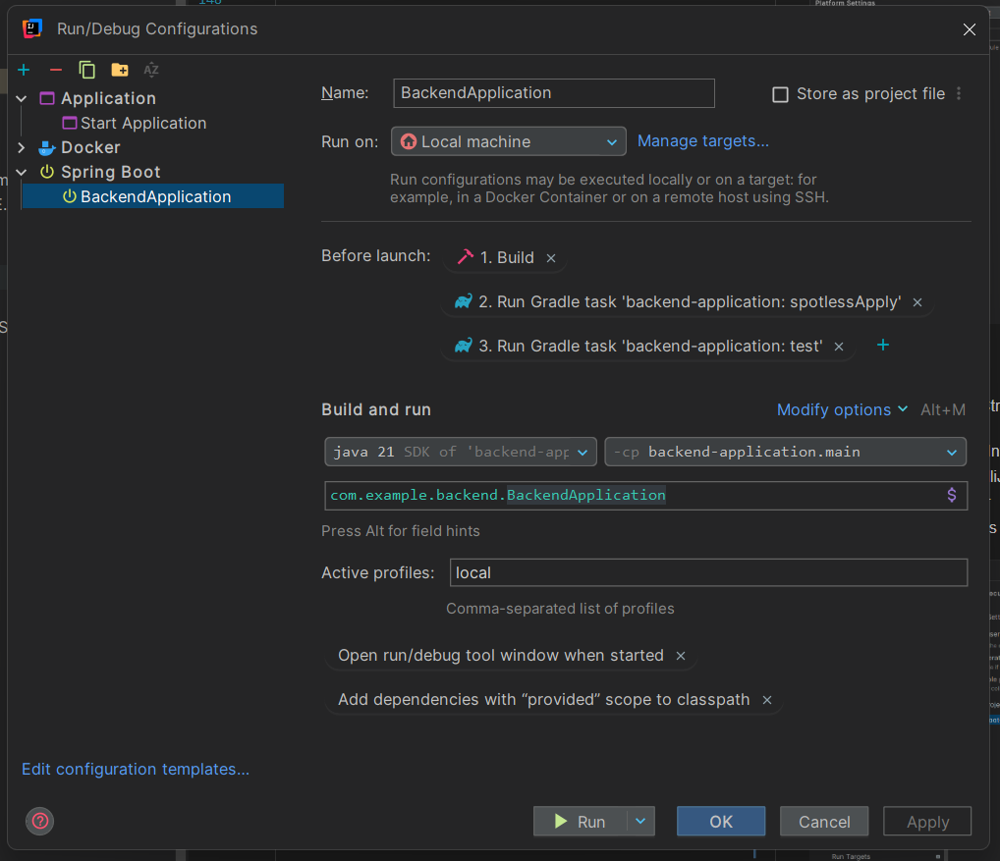
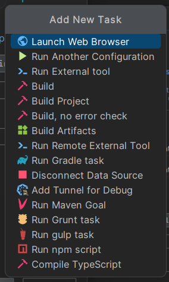
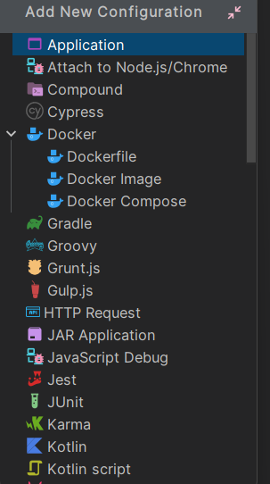
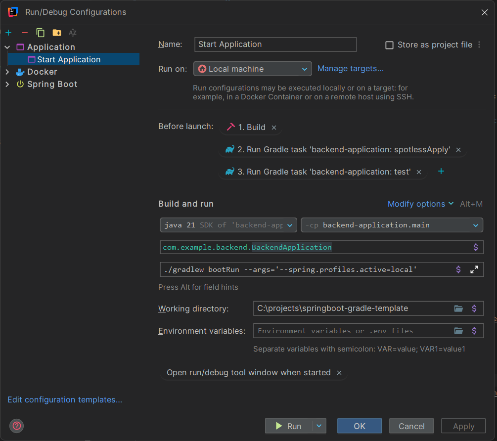

# Backend Application - Spring Boot Template

A production-ready Spring Boot backend application template demonstrating best practices for building scalable monolithic applications.

## 🚀 Features

- **Spring Boot 3.2.0** with Java 21
- **Gradle Kotlin DSL** for build configuration
- **MySQL 8.0** database with HikariCP connection pooling
- **Flyway** for database migrations
- **Lombok** for reducing boilerplate code
- **MapStruct** for type-safe object mapping
- **OpenAPI/Swagger** for API documentation
- **JPA/Hibernate** with optimistic locking
- **Comprehensive error handling** with global exception handler
- **Caching** support with Spring Cache abstraction
- **Structured logging** with Logback and JSON formatting
- **Docker Compose** for local development environment
- **JUnit 5** and **Mockito** for testing
- **Checkstyle** for code quality
- **JaCoCo** for code coverage

## 📋 Prerequisites

- JDK 21
- Docker and Docker Compose
- Gradle 8.x (wrapper included)

## 🛠️ Project Structure

```
backend-application/
├── src/
│   ├── main/
│   │   ├── java/com/example/backend/
│   │   │   ├── config/              # Configuration classes
│   │   │   ├── controller/          # REST controllers
│   │   │   ├── dto/                 # Data Transfer Objects
│   │   │   ├── entity/              # JPA entities
│   │   │   ├── exception/           # Custom exceptions & handlers
│   │   │   ├── mapper/              # MapStruct mappers
│   │   │   ├── repository/          # JPA repositories
│   │   │   ├── service/             # Business logic layer
│   │   │   └── BackendApplication.java
│   │   └── resources/
│   │       ├── db/migration/        # Flyway migrations
│   │       ├── application.yml      # Main configuration
│   │       ├── application-test.yml # Test configuration
│   │       └── logback-spring.xml   # Logging configuration
│   └── test/
│       └── java/com/example/backend/
│           └── service/             # Unit tests
├── docker/
│   └── mysql/
│       └── init.sql                 # Database initialization
├── config/
│   └── checkstyle/
│       └── checkstyle.xml           # Code style rules
├── build.gradle.kts                 # Gradle build configuration
├── docker-compose.yml               # Docker services
└── README.md
```

## 🚀 Getting Started

### 1. Start the Database

```bash
docker-compose up -d
```

This will start:
- MySQL 8.0 on port 3306
- Redis on port 6379

### 2. Build the Application

```bash
./gradlew build
```

### 3. Run the Application

```bash
./gradlew bootRun --args='--spring.profiles.active=local'
```

The application will be available at: `http://localhost:8080`

## 📚 API Documentation

Once the application is running, access the interactive API documentation:

- **Swagger UI**: http://localhost:8080/swagger-ui.html
- **OpenAPI JSON**: http://localhost:8080/api-docs

### Health & Monitoring

- **Health Check**: http://localhost:8080/actuator/health
- **Metrics**: http://localhost:8080/actuator/metrics

## 🧪 Testing

### Run All Tests

```bash
./gradlew test
```

### Run Tests with Coverage Report

```bash
./gradlew test jacocoTestReport
```

Coverage report will be available at: `build/reports/jacoco/test/html/index.html`

### Run Checkstyle

```bash
./gradlew checkstyleMain checkstyleTest
```

## 🔧 Configuration

### Database Configuration

Edit `src/main/resources/application.yml`:

```yaml
spring:
  datasource:
    url: jdbc:mysql://localhost:3306/backend_db?useSSL=false&allowPublicKeyRetrieval=true&serverTimezone=UTC
    username: backend_user
    password: backend_password
```

### Application Properties

Key configuration properties:

- `server.port`: Application port (default: 8080)
- `spring.jpa.hibernate.ddl-auto`: Hibernate DDL mode (validate/update/create)
- `logging.level.*`: Logging levels per package
- `management.endpoints.web.exposure.include`: Actuator endpoints

## 🐳 Docker Support

### Build Docker Image

```bash
./gradlew bootBuildImage
```

### Run with Docker Compose

The provided `docker-compose.yml` includes:
- MySQL 8.0 database
- Redis cache server
- Health checks
- Persistent volumes

---

## IntelliJ IDEA Setup Guide

### 1. Project Structure

First, configure the project SDK. Open the **Project Structure** menu (**Ctrl + Alt + Shift + S** on Windows) and set the SDK to **Amazon Corretto 21.0.9**.



### 2. Gradle Settings

Navigate to **Settings** (**Ctrl + Alt + S** on Windows) and configure the following under **Build, Execution, Deployment > Build Tools > Gradle**:

* **Build and run using:** IntelliJ IDEA
* **Run tests using:** IntelliJ IDEA
* **Distribution:** Wrapper
* **Gradle JVM:** Project SDK (Amazon Corretto 21.0.9)



### 3. Run Configurations

There are two ways to configure the application for local execution:

#### Option A: Spring Boot Configuration (Ultimate Edition)

This is the preferred method if you are using IntelliJ IDEA Ultimate. Click **Edit Configurations...** at the top of the IDE, create a new **Spring Boot** configuration, and apply these settings:

* **Name:** BackendApplication
* **Build and run:** Java 21 -> `com.example.backend.BackendApplication`
* **Active profiles:** `local`
* **Before launch (Add tasks in order):**
1. Build
2. Run Gradle task: `backend-application:spotlessApply`
3. Run Gradle task: `backend-application:test`



> **Note:** To add pre-launch tasks, click the **+** icon in the "Before launch" section.



#### Option B: Application Configuration (Community/Free Edition)



If you are using the Community Edition, use the standard **Application** configuration:

1. Click **Add New Configuration** and select **Application**.
2. Set **Main class** to `com.example.backend.BackendApplication`.
3. Set **Program arguments** to:
   `./gradlew bootRun --args='--spring.profiles.active=local'`
4. Set **Working directory** to your project root (e.g., `C:\projects\springboot-gradle-template`).
5. **Before launch (Add tasks in order):**
1. Build
2. Run Gradle task: `backend-application:spotlessApply`
3. Run Gradle task: `backend-application:test`


